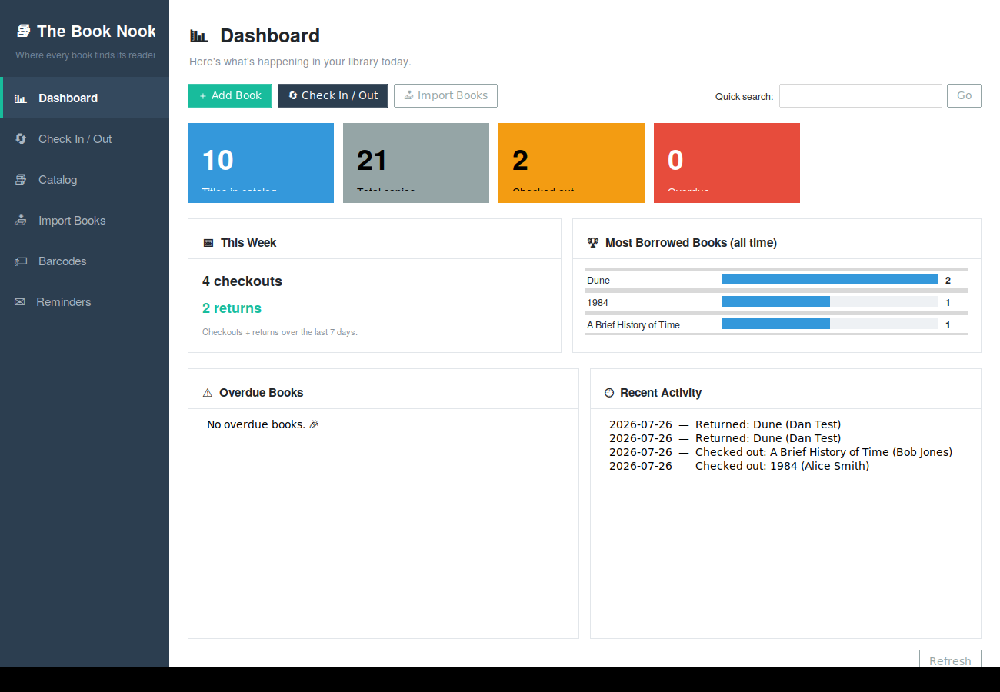
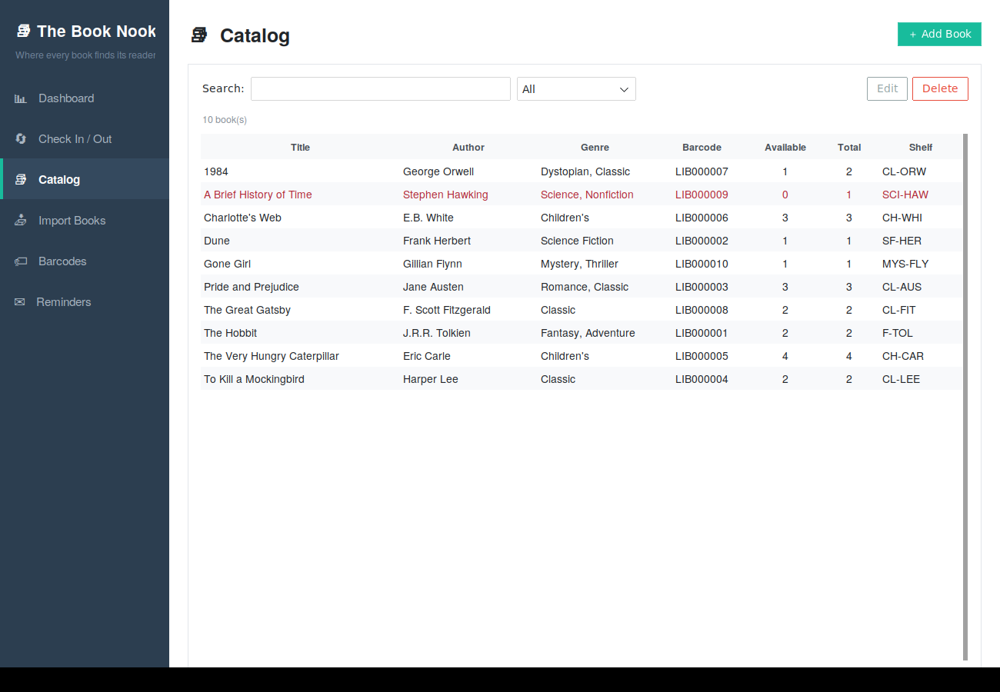
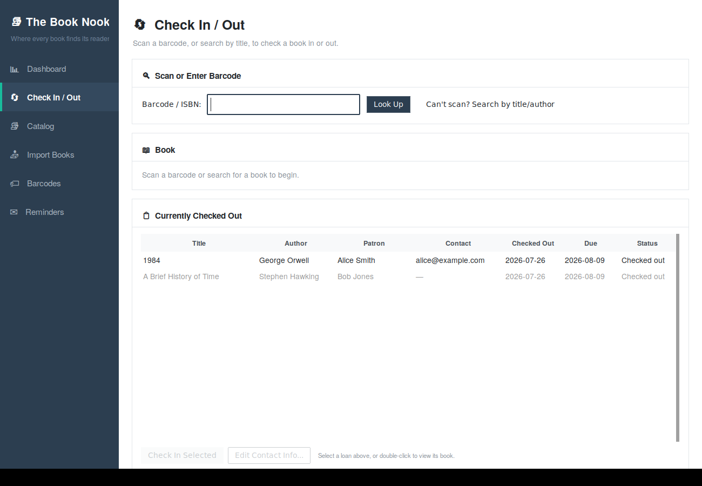

# The Book Nook
### *Where every book finds its reader*

A desktop book management system for a small library — searchable catalog,
check-in/check-out, bulk CSV import, and barcode label generation. Built to
run comfortably today with no special hardware, and to grow into a barcode
scanner + label printer setup later with **zero code changes**.





## Features

- **Search** the catalog by title, author, genre, or barcode/ISBN — one search
  box, instant results. **True multi-column sorting** — click a column to
  sort by it, Shift+click another to add it as the next sort level (e.g.
  Author, then Title), just like a library card catalog.
- **Check-out / check-in** with a scan-or-type barcode field, due dates,
  multi-copy tracking, overdue flagging, early returns (check in a specific
  copy even while others of the same book are still checked out), and a
  "can't scan? search by title/author" fallback for books that don't have
  a printed label yet.
- **Edit a loan's contact info anytime** — add or correct a patron's email
  or phone number after checkout, right from the Check In/Out tab, without
  needing to re-do the checkout.
- **Due-date email reminders** — automatically emails a patron when a book
  is approaching, at, or past its due date, at whatever intervals you set
  (e.g. 3 days before, on the due date, 3 and 7 days after). Subject and
  body wording is fully customizable per reminder type, with a live preview.
- **Bulk import** from CSV, with automatic column-name detection (works with
  exports from spreadsheets or other library systems) and a mapping screen
  you can adjust before importing.
- **Barcode generator** — every book gets a unique Code128 barcode
  automatically. Print a ready-to-use label sheet PDF today on regular
  adhesive label paper (Avery 5160 by default), or export individual PNGs.
  Match your exact label stock by picking a common Avery product, uploading
  Avery's own template file, or entering the dimensions by hand — and
  choose exactly what prints on each label (barcode, title, author, genre,
  shelf location, ISBN, in any combination).
- **A real dashboard** — quick actions (add a book, jump to check-out,
  import), a quick-search box, clickable stat cards that jump straight to
  the relevant section, a "most borrowed books" chart, this week's
  checkout/return activity, the overdue list, and recent activity, all in
  one place.
- A clean sidebar-navigated interface — no more hunting through tabs.

## Getting started

### 1. Install Python

Python 3.9 or newer. Check with:

```
python3 --version
```
(On Windows, the command is usually `python --version` instead — Windows
doesn't use the `python3` name by default.)

### 2. Install Tk (only needed on Linux)

Windows and Mac Python installers already include Tk. On Linux (Ubuntu/Debian):

```
sudo apt-get install python3-tk
```

### 3. Install the app's dependencies

From inside this folder:

```
pip install -r requirements.txt
```

(On some Linux systems, and occasionally on Windows with Python installed
from the Microsoft Store, you may need
`pip install -r requirements.txt --break-system-packages`.)

### 4. Run it

```
python3 main.py
```
(On Windows: `python main.py`.)

A window opens with a left-hand sidebar for navigation — Dashboard, Check
In/Out, Catalog, Import Books, Barcodes, and Reminders. The library's data
is stored locally in `data/library.db` (created automatically on first
run) — back this file up periodically (just copy it) since it's your
entire catalog and checkout history.

## Try it with sample data

`sample_data/sample_books.csv` has 10 example books. Open the **Import
Books** tab, choose that file, confirm the column mapping (it auto-detects
correctly for this file), and click **Import Books** to see the system
populated.

## Day-to-day use

**Adding books:** Catalog tab → "+ Add Book", or bulk-add via Import Books.
A barcode is generated automatically for every new book.

**Checking a book out:** Check In/Out tab → type or scan the barcode →
Enter. If a scanner isn't hooked up yet, click "Can't scan? Search by
title/author" to find the book instead. Enter the patron's name and click
Check Out.

**Checking a book back in:** same barcode field — every currently checked-out
copy of that book is listed with its own **Check In** button, so you can
return a specific copy early even if the book has other copies still out
or available. You can also select any loan directly in the "Currently
Checked Out" table at the bottom of the tab and click **Check In Selected**
— no need to look up the book first.

**Adding or fixing a patron's contact info after checkout:** select a loan
in the "Currently Checked Out" table (or scan the book) and click
**Edit Contact Info...** This is the easiest way to add an email address
after the fact so due-date reminders can start reaching that patron.

**Printing barcode labels:** Barcodes tab → "Label Sheet PDF — All Books"
saves a PDF laid out for standard adhesive label sheets, ready to print
from any regular printer.

**Sorting the catalog like a real library** (author, then title, then
whatever else you want): click any column header in the Catalog, Barcode,
or "search by title/author" table to sort by it. **Shift+click** another
column to add it as the next sort level without losing the first — click
**Author**, then Shift+click **Title**, and books are grouped by author
with each author's books in title order underneath, exactly like a card
catalog. Column headers show a small ▲/▼ and a number (▲1, ▲2, ...) so you
can see the active sort order at a glance. Click (or Shift+click) an
already-sorted column again to flip its direction. A plain click on any
column always starts a fresh single-column sort.

## Email reminders

The **Reminders** tab sends an automatic email to a patron when their book
is coming due, due today, or overdue — as long as an email address was
entered in the **Contact** field at checkout time.

**Setup:**
1. Go to the Reminders tab and fill in your email account's SMTP details
   (server, port, username/password, from address).
   - Gmail: `smtp.gmail.com`, port `587`, security `starttls`. Gmail
     requires an **app password**, not your normal login password — create
     one at myaccount.google.com → Security → App passwords.
   - Outlook/Office365: `smtp.office365.com`, port `587`, `starttls`.
   - Most web hosts and other providers publish their SMTP settings on a
     support page — search "\[provider name] SMTP settings."
2. Click **Send Test Email...** to confirm it works before relying on it.
3. Set your reminder schedule as a comma-separated list of day-offsets from
   the due date — negative numbers are *before* the due date, `0` is *on*
   the due date, positive numbers are *after* (overdue). The default
   `-3, 0, 3, 7` sends a heads-up 3 days early, a reminder on the day, and
   two overdue nudges.
4. Turn on **"Automatically send reminders while the app is open"** and
   click **Save Settings**.

**How the automatic check works:** while the app is running, it checks for
due reminders about once an hour (and once shortly after startup), sending
any that are due and skipping ones already sent. There's no background
service — reminders only go out while the app is open. If that doesn't fit
how you'll use the app, click **Check & Send Reminders Now** at the start
of each day instead, or leave the app running on a library computer.

Every attempt (sent, failed, or skipped because there was no valid email on
file) is recorded in the Reminder Log at the bottom of the tab, so you can
always see what went out and to whom.

**A note on the password field:** SMTP credentials are stored locally in
`data/settings.json`, in plain text, so they're readable by anyone with
access to that computer/file — the same way most small desktop tools handle
this. Don't reuse a sensitive password for the library's email account, and
consider a dedicated account or an app password scoped just for this.

### Customizing the email wording

Reminders tab → **"Customize Email Templates..."** opens an editor with a
separate subject/body for each of the three reminder situations (Before
Due, Due Today, Overdue). Use any of these placeholders in either field —
they get filled in per patron/book when the email actually sends:

`{patron_name}`  `{title}`  `{author}`  `{due_date}`  `{library_name}`
`{days_phrase}` (e.g. "3 days")  `{days}` (just the number)

Click **Preview** to see exactly what a patron would receive, using sample
data, before saving. **Reset to Default** restores the original wording for
that one scenario. A misspelled placeholder (like `{tital}`) won't crash
anything — it just shows up literally in the preview/email so you can spot
and fix the typo.

## Growing into more hardware
This system is built so buying new hardware later is a plug-and-play
upgrade, not a rewrite:

- **Barcode scanner (USB or Bluetooth):** these devices work by "typing"
  the scanned code into whatever text field is focused, followed by Enter
  — exactly like a keyboard. The barcode field on the Check In/Out tab
  already behaves this way, so once you plug in a scanner, just click into
  that field and start scanning. No settings to change.

- **Barcode label printer:** the barcodes this app generates (Code128) are
  a universal format any label printer can use. Once you have one, either:
  - point its own label-design software at the barcode PNGs
    (Barcodes tab → "Individual PNGs — All Books"), or
  - keep using the built-in PDF label sheet generator — Barcodes tab →
    "Change Label Sheet Settings..." to match its label dimensions (see
    below for the easiest ways to do that).

## Label sheet layout — matching your label stock

Barcodes tab → **"Change Label Sheet Settings..."** offers three ways to
get the layout right, in order of how much they do for you:

1. **Pick your Avery product from the list** — the most reliable option.
   A handful of the most common Avery label products (5160, 5161, 5162,
   5163, 5167, 5265) are built in with their published dimensions.
2. **Upload the template file Avery provides for that product** (`.docx`
   or `.pdf`, from avery.com or the product packaging) — the app reads the
   page size, margins, and grid straight from the file:
   - **Word (`.docx`) templates** are quite reliable — Avery builds these
     as an actual table (one cell per label), so the layout is read
     directly from the document rather than guessed.
   - **PDF templates** are best-effort — some are vector files with a
     detectable grid of label outlines, which works well; others are
     flattened images with no structure to read, in which case the app
     will say plainly that it couldn't detect a layout rather than
     silently guessing wrong. If that happens, try the `.docx` version of
     the same template (Avery usually offers both) or use a preset instead.
3. **Type the numbers in by hand** — always available in the same dialog,
   and also where you land after a preset or upload so you can fine-tune
   anything before saving.

Whichever route you use, **print a test sheet on plain paper first** and
hold it up to a real label sheet before committing actual labels to it.

### Choosing what prints on each label

In that same dialog, **"What to print on each label"** lets you check off
any combination of: Barcode, Title, Author, Genre, Shelf Location, and
ISBN. The barcode (if checked) is the scannable image at the top; anything
else you check prints as text beneath it, in that order. Want spine labels
with just a shelf code and no barcode? Uncheck everything except Shelf
Location. Want the full picture for a new shipment of books? Check them
all. At least one item must stay checked.

## Desktop app (macOS) — no more typing commands

Once dependencies are installed once (step 3 above), you don't need to open
Terminal again. There are two ways to launch it with a click instead:

**Option A — the included launcher (works immediately, easiest):**
Double-click **`Launch The Book Nook.command`** in this folder. The first
time, macOS will refuse to open it because it's not from an identified
developer — right-click it, choose **Open**, then confirm. After that, a
plain double-click works every time. It briefly opens a Terminal window (so
you can see any error messages) and closes it when you quit the app.

**Option B — a real Dock/Desktop icon with no Terminal window at all
(~2 minutes to set up, using Automator, which is already on your Mac):**
1. Open **Automator** (Spotlight → type "Automator").
2. **File → New**, choose **Application**, click Choose.
3. In the search box on the left, type "Run Shell Script" and drag it into
   the workflow area on the right.
4. Paste this into the script box (replace the path with wherever you put
   this project):
   ```
   cd "/full/path/to/the_book_nook"
   /usr/bin/python3 main.py
   ```
5. **File → Save**, name it "The Book Nook", save it to
   **Applications** or the **Desktop**.
6. Optional — give it a proper icon: find any image you like, open it in
   Preview, Select All, Copy. Then select your new Book Nook app in
   Finder, press **⌘I** to get info, click the small icon in the top-left
   of that info window, and **⌘V** to paste.

Now double-clicking that app launches The Book Nook directly — no
Terminal window, just like any other Mac app. You can drag it to the Dock.

*(There's also a more involved option — bundling everything into one
fully self-contained `.app` with `py2app`, so it doesn't even need Python
pre-installed on the machine running it. See `packaging/setup_py2app.py`
if you want to go that route; it needs to be built on a Mac and may need
some troubleshooting, so Option B above is the more reliable path for
most people.)*

## Desktop app (Windows) — no more typing commands

Once dependencies are installed once (step 3 above), you have two
double-click options, already included in this folder:

**Option A — `Launch The Book Nook.bat` (easiest, shows a window you can
read if something goes wrong):**
Double-click it. Windows may show a "Windows protected your PC" warning the
first time since it isn't digitally signed — click **More info**, then
**Run anyway**. It checks for Python, installs/updates dependencies if
needed, and starts the app. A console window stays open behind it so you
can see any error messages; closing that window closes the app.

**Option B — `The Book Nook.pyw` (no console window at all):**
Windows normally associates `.pyw` files with `pythonw.exe` automatically
(installed alongside Python), which runs with **no visible window** other
than the app itself — the closest thing to a native double-click app on
Windows, and it needs no extra setup. Just double-click it.
- This option skips the automatic dependency install that the `.bat` does,
  so run `Launch The Book Nook.bat` (or `pip install -r requirements.txt`)
  at least once first.
- To make it easier to find: right-click **`The Book Nook.pyw`** →
  **Send to** → **Desktop (create shortcut)**. You can rename that shortcut
  and give it a custom icon via right-click → **Properties** → **Change
  Icon...** (any `.ico` file, or convert a picture to `.ico` with a free
  online converter first).

## Configuration

Everything tunable lives in `app/config.py`:

- `DEFAULT_LOAN_DAYS` — how many days a checkout lasts by default (14).
- `LABEL_SHEET` — label sheet dimensions/layout for the PDF exporter.
- `THEME` — GUI color theme (try `"darkly"`, `"journal"`, `"cosmo"`, etc. —
  see [ttkbootstrap's theme gallery](https://ttkbootstrap.readthedocs.io/en/latest/themes/)).
- `BARCODE_PREFIX` — prefix used for auto-generated barcodes (default `LIB`).

## Project structure

```
the_book_nook/
├── main.py                 Entry point — run this
├── requirements.txt
├── Launch The Book Nook.command   Double-click launcher (macOS/Linux)
├── Launch The Book Nook.bat       Double-click launcher (Windows)
├── The Book Nook.pyw              No-console double-click launcher (Windows)
├── packaging/
│   └── setup_py2app.py     Optional: build a standalone .app (advanced, macOS only)
├── app/
│   ├── config.py           All tunable settings
│   ├── settings.py         User-editable settings (SMTP, reminder schedule) - saved to data/settings.json
│   ├── database.py         SQLite schema + all data operations
│   ├── barcodes.py         Barcode image + label sheet PDF generation
│   ├── label_template.py   Avery template parsing (.docx/.pdf) + built-in presets
│   ├── importer.py         CSV import logic
│   ├── email_utils.py      SMTP sending + reminder email templates
│   ├── reminder_engine.py  Figures out which checkouts need a reminder and sends them
│   └── gui/
│       ├── main_window.py  Top-level window, tabs, menu, background reminder scheduler
│       ├── dashboard_tab.py
│       ├── checkout_tab.py
│       ├── catalog_tab.py
│       ├── import_tab.py
│       ├── barcode_tab.py
│       ├── reminders_tab.py
│       └── widgets.py       Shared small GUI components
├── sample_data/
│   └── sample_books.csv    Example data for trying the app
├── data/                   library.db and settings.json live here (created on first run)
└── exports/                 scratch folder used during PDF export
```

## Troubleshooting

- **`ModuleNotFoundError: No module named 'tkinter'`** — install Tk for your
  OS (see step 2 above).
- **CSV import skips rows** — the import screen shows exactly which rows
  failed and why (usually a missing Title or Author). Fix the CSV and
  re-import; already-imported rows won't be duplicated unless you import the
  same file twice.
- **Barcode won't scan on a physical scanner** — nearly all USB/Bluetooth
  barcode scanners need no drivers and just act like a keyboard. Make sure
  the barcode text field is focused (click into it) before scanning, and
  that the scanner is configured to send an Enter/Return keystroke after
  each scan (this is the default on virtually every model).
- **Test email fails with `CERTIFICATE_VERIFY_FAILED`** — this is a known
  quirk of Python installed from python.org on macOS: it ships its own
  OpenSSL that doesn't see your Mac's trusted certificates. The app already
  works around this automatically using the `certifi` package (added in
  `requirements.txt`) — if you're hitting this, run
  `pip install -r requirements.txt --upgrade` (or re-run the `.command`
  launcher, which does this for you) to make sure `certifi` is installed,
  then try the test email again.
